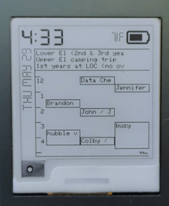

# WatchyFlow

WatchyFlow is a firmware for the [SQFMI Watchy](https://watchy.sqfmi.com/).
WatchyFlow started as a Calendar-drawing watch face for the original firmware,
but morphed into a fork and then a kind-of rewrite over time.

WatchyFlow supports:
 * graphical drawing of multiple concurrent iCal sources (including Google
   Calendar), with help from a dedicated server component. It will draw
   your calendar in an hour by hour view (scrollable!), and in
   a full-day-event view for a birds-eye view of your month.
 * local temperature and weather indications
 * step counting
 * iCal-driven alarms
 * a watch-driven timer
 * a stopwatch
 * multiple wifi access points

WatchyFlow also provides a layout system for drawing views and organizing
apps on the Watchy in an easy and intuitive way.

WatchyFlow is fairly efficient and uses very little battery power. My v3
Watchy running WatchyFlow can last many days without any charge.

## Images

<p float="left">
  
  
  
  
  
</p>

## Using WatchyFlow

### Starting the server

The first step to getting WatchyFlow working is to identify a location where
you can run a small Python server to aggregate and process your iCal files.

Inside `watchy_server/`, configure `cals.json` (using `cals.json.example`).
Choose a secret key (`python3 -c "import os; print(os.urandom(16).hex())"`),
set your email, and add your iCal URLs.

Note that you can exclude calendar events with certain strings in them, if they
are not worth showing on your watch.

Then run the watchy server. Using [uv](https://docs.astral.sh/uv/), you can do:

```
uv run main.py
```

### Configure the watch

Inside `WatchyFlow/`, configure `settings.h` (using `settings.h.example`).
 * Your `calendarAccountURL` should hit your Python server at its host and port
   with path `/v0/account/[your-secret-key]`.
 * You'll want to set up your weather URL by getting an API key from
   OpenWeatherMap and configuring your lattitude and longitude.
 * You'll want to make sure any WiFi access points you use are listed.
   WatchyFlow will keep track of which one was most recently successful and
   prefer it.

### Deploying to the watch

The instructions are the same as they are for the official firmware! You can
use the basic Arduino instructions provided
[for v3](https://watchy.sqfmi.com/docs/getting-started) or
[for v2](https://watchy.sqfmi.com/docs/legacy).

A lot of ESP32 development has started to switch to
[PlatformIO](https://platformio.org/), but instead of abandoning the Arduino
IDE, this project supports the
[arduino-cli](https://github.com/arduino/arduino-cli), for many of the same
reproducibility benefits PlatformIO provides.

If you prefer to use the Arduino CLI, you can deploy to your watch by running
the provided `deploy.sh` script, either `./deploy.sh v3` or `./deploy.sh v2`,
depending on the kind of Watchy you have.

### Using the watch

The watch starts showing the hourly calendar view. The up and down buttons let
you scroll through the hourly calendar. The back button will either reset
your scroll position or switch to the day event view. In the day event view,
the up button will toggle how much space is given to the calendar, and the
down button will toggle whether days are given relative or absolute.

In hourly view, the watch will show the current day's day events along the top.

If a calendar event from any one of your iCal files contains the string
`[WATCHY ALARM]`, that calendar event is handled specially. The end time is
ignored and the start time is treated as an alarm. Upcoming alarms are shown
along the bottom of the calendar view. Alarms simply have a strong vibration,
as the Watchy doesn't have a speaker.

The calendar view will also provide a small vibration when a standard event
begins.

The select button will open the menu. This is where the stopwatch, timer, and
other tools exist.

If your calendar needs to be resynced, you can trigger a network fetch in the
tools menu, which will ask the Watchy to reconnect to the network and fetch
information. However, the watchy server has its own cache, and so if you want
the watchy server to drop its cache, you can trigger that from the watch using
the calendar reset option in the tools menu.

Note that, because the WatchyFlow framework only currently guarantees wake
events to dependent apps once a minute, the timer is only accurate down to the
approximate minute.

## Developing with WatchyFlow

### LayoutElements

WatchyFlow is a framework composed of `LayoutElement` types that, if you
squint, somewhat mimics a declarative UI framework like React or Flutter.
Instead of requiring every watch face element to draw directly with pixel
offsets, you can compose a hierarchy of elements and containers and tell them to
draw themselves at the appropriate locations.

The following LayoutElements exist:
 * `LayoutBitmap` - draws a provided bitmap
 * `LayoutText` - draws text in the provided font
 * `LayoutRows`, `LayoutColumns` - a vertical or horizontal stack of other
    layout elements
 * `LayoutRotate` - rotates its descendents a right angle
 * `LayoutBorder` - draws a border around its child
 * `LayoutBackground` - fills the background before drawing its child
 * `LayoutOverlay` - draws an element on top of another element
 * `LayoutFill` - stretches to fill available space
 * `LayoutCenter`, `LayoutHCenter`, `LayoutVCenter` - centers its child
 * `LayoutPad` - pads its child
 * `LayoutSpacer` - a small non-breaking space element
 * `LayoutRightAlign`, `LayoutBottomAlign` - aligns child element to a far side
 * `LayoutCell` - a mutable container for a LayoutElement

There are also some more complex element types such as

 * `LayoutWeatherIcon` - shows an icon appropriate for the current weather
  status
 * `LayoutButtonLabels` - places small label text near each hardware button to
  indicate what the buttons do in the current application context.
 * `LayoutBattery` - shows a battery with the current Watchy battery level

It's worth taking a look at the `LayoutButtonLabels` constructor in
[Buttons.cpp](https://github.com/jtolio/watchyflow/blob/main/WatchyFlow/src/Elements/Buttons.cpp)
for a brief example of the power of this declarative approach.

### WatchyApp

WatchyFlow apps are composed of a hierarchy of `WatchyApp` types. The following
Watchy Apps exist:

 * `CalendarApp` - this is the main app
 * `AboutApp` - this shows diagnostic information
 * `HomeApp` - this app allows you to switch between a main app and a menu app
 * `MenuApp` - this app lets you toggle between a number of other apps
 * `StopwatchApp` - a stopwatch app
 * `TimerApp` - a timer app
 * `ResetStepCounterApp` - a menu item for resetting the step counter
 * `TriggerNetworkFetchApp` - a menu item for triggering a network fetch
 * `TriggerCalendarResetApp` - a menu item for telling the calendar server to
  clear its cache

You can implement your own! Just subclass the `WatchyApp` abstract base class
and read the notes in the `WatchyApp.h` header file.

## Licensing

See LICENSE for copyright information.


